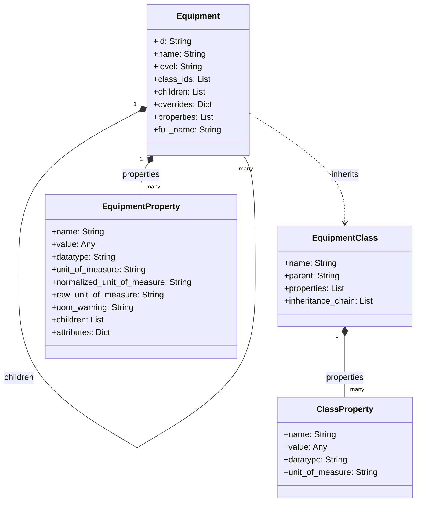
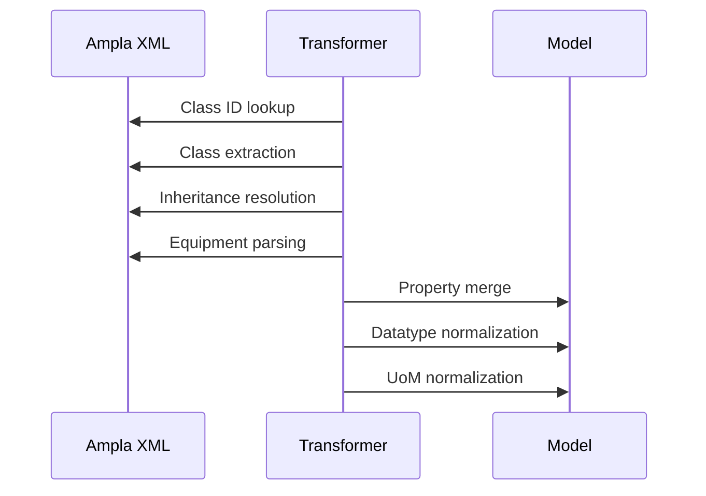

# **Ampla → B2MML V0600 Transformer**

A deterministic transformer that converts **Ampla Project XML** into an **ISA‑95 B2MML V0600 Equipment model**.  
The system replaces the legacy XSLT pipeline with a structured Python implementation.

Outputs:

- B2MML V0600 XML  
- JSON model  
- Excel workbook  
- CSV exports  
- HTML report  

Tools:

- CLI  
- FastAPI service  
- Validation  
- Diff engine  
- Statistics  

The project includes a full regression suite.

---

## **Function**

Ampla XML contains:

- equipment hierarchy  
- equipment classes  
- inheritance  
- class and instance properties  

The transformer produces:

- B2MML V0600 Equipment XML  
- normalized internal model  
- export formats for reporting and auditing  

The system also reports:

- unmapped types  
- unknown class IDs  
- structural violations  
- missing or malformed data  

---

## **Architecture**

The core component is:

```python
from app.transformers.ampla_to_b2mml import AmplaTransformer
```

### **Transformation Passes**

1. Build class ID lookup  
2. Extract classes  
3. Compute inheritance chains  
4. Parse equipment tree  
5. Resolve full names  
6. Merge class and instance properties  
7. Normalize datatypes  
8. Normalize units of measure  
9. Sort and finalize model  

The result is a stable internal representation used by all builders.

---

## **Data Model**

### **UML**



---

## **Pipeline**



---

## **Configuration**

Configuration is stored in:

```
config/mapping.toml
```

Example:

```toml
[level_map]
"Citect.Ampla.Isa95.EnterpriseFolder" = "Enterprise"
"Citect.Ampla.Isa95.SiteFolder" = "Site"
"Citect.Ampla.Isa95.AreaFolder" = "Area"
```

Datatypes are mapped and normalized to lowercase.

Units of measure are normalized through the UoM map.

---

## **Programmatic Use**

```python
from lxml import etree
from app.transformers.ampla_to_b2mml import AmplaTransformer

root = etree.parse("input.xml").getroot()
transformer = AmplaTransformer("config/mapping.toml")
model = transformer.transform(root)
```

The model contains:

```python
{
    "equipment": [...],
    "classes": [...],
    "warnings": [...]
}
```

---

## **CLI**

### Convert to B2MML XML

```
b2mml convert input.xml output.xml
```

### JSON

```
b2mml json input.xml
```

### Excel

```
b2mml excel input.xml output.xlsx
```

### CSV

```
b2mml csv equipment input.xml
b2mml csv classes input.xml
```

### HTML

```
b2mml html input.xml report.html
```

### Diff

```
b2mml diff baseline.xml updated.xml
```

Exit codes:

- `0` → no differences  
- `1` → differences found  

### Validate

```
b2mml validate input.xml
```

Exit codes:

- `0` → no warnings  
- `1` → warnings present  

---

## **FastAPI**

Start:

```
uvicorn app.api:app --reload
```

Endpoints:

| Method | Path | Description |
|--------|------|-------------|
| POST | `/convert/json` | JSON model |
| POST | `/convert/xml` | B2MML XML |
| POST | `/convert/excel` | Excel workbook |
| POST | `/convert/csv/equipment` | Equipment CSV |
| POST | `/convert/csv/classes` | Classes CSV |
| POST | `/convert/html` | HTML report |
| POST | `/stats` | Statistics |
| POST | `/diff/json` | JSON diff |
| POST | `/validate` | Validate model |

---

## **Docker**

Start:

```
make up
```

Stop:

```
make down
```

Service runs at:

```
http://localhost:8000
```

---

## **Project Layout**

- `app/parsers` — XML parsing  
- `app/transformers` — Ampla → model  
- `app/builders` — XML, JSON, Excel, CSV, HTML  
- `app/validators.py` — structural checks  
- `app/diff.py` — diff engine  
- `app/stats.py` — statistics  
- `app/cli.py` — CLI  
- `app/api.py` — FastAPI service  
- `tests/` — full regression suite  

---

## **License**

BSD 3‑Clause License.

### Third‑Party Notices

This project includes B2MML V0600 XML Schema Definition files.  
These files are copyrighted by MESA International and are provided under the MESA International License Agreement.
