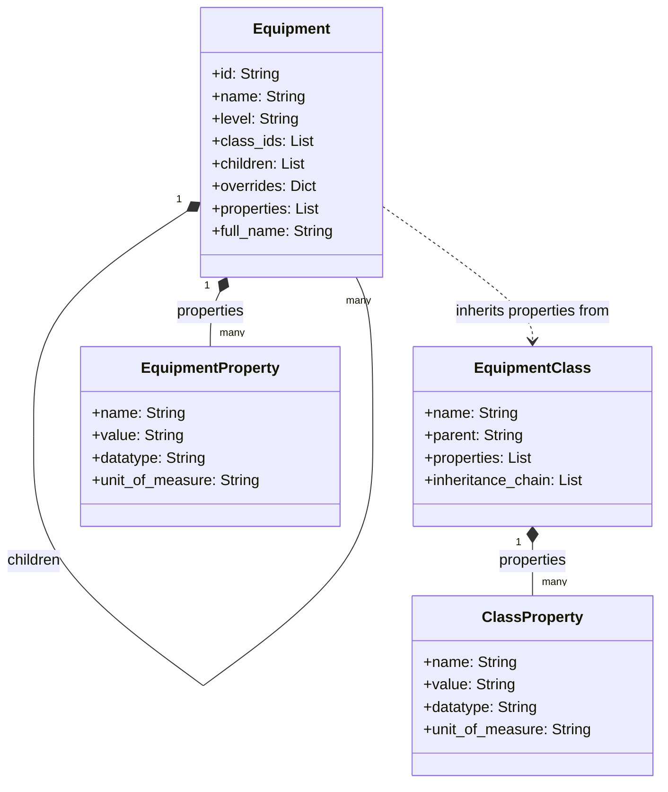
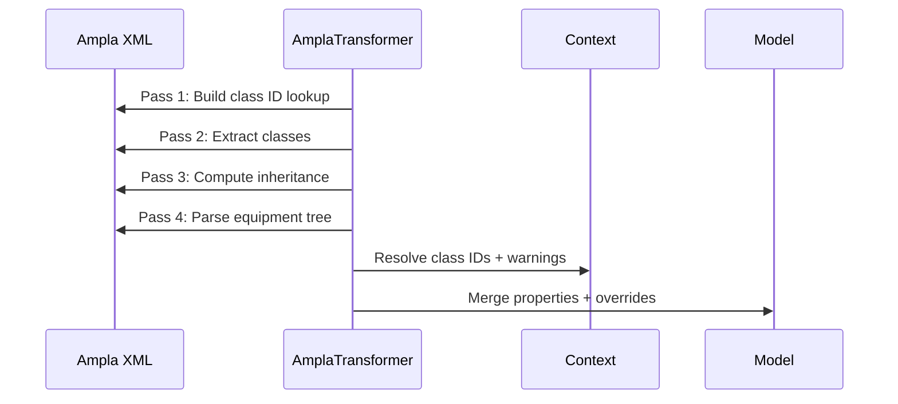

# **Ampla → B2MML V0600 Transformer**

A modern, deterministic, fully‑tested transformer that converts **Ampla Project XML** into an **ISA‑95 B2MML V0600 Equipment model**.  
It replaces the legacy XSLT pipeline with a structured Python implementation featuring:

- a clean multi‑pass transformation engine  
- a command‑line interface  
- a FastAPI service  
- JSON, XML, Excel, CSV, and HTML outputs  
- validation, diffing, and statistics  
- complete regression test coverage  

---

## **What this tool does**

Ampla Project XML contains:

- equipment hierarchy  
- equipment classes  
- inheritance relationships  
- class and instance properties  

This transformer parses the XML and produces:

- **B2MML V0600 Equipment XML**  
- **JSON model**  
- **Excel workbook (.xlsx)** with Equipment + Classes sheets  
- **CSV exports**  
- **HTML report**  

Additional capabilities:

- **structural validation warnings** (unknown class IDs, unmapped types, malformed items)  
- **diff mode** for comparing two Ampla configurations  
- **statistics** (counts, depth, class usage)  
- **deterministic output** suitable for CI and configuration auditing  

---

## **Architecture Overview**

The core of the system is a multi‑pass transformer:

```python
from app.transformers.ampla_to_b2mml import AmplaTransformer
```

### **Transformation passes**

1. **Class ID lookup**  
2. **Class extraction + inheritance chain computation**  
3. **Equipment tree parsing**  
4. **Full‑name resolution**  
5. **Property merging** (class inheritance + instance overrides)  
6. **Normalization + sorting**  

The result is a clean internal model used by all output builders.

---

## **Data Model**

The transformer produces a normalized, format‑agnostic model.

### UML



### Pipeline Sequence



---

## **Configuration**

Mappings are externalized in:

```
config/mapping.toml
```

Example:

```toml
[level_map]
"Citect.Ampla.Isa95.EnterpriseFolder" = "Enterprise"
"Citect.Ampla.Isa95.SiteFolder" = "Site"
"Citect.Ampla.Isa95.AreaFolder" = "Area"
"Citect.Ampla.General.Server.ApplicationsFolder" = "Other"
```

If missing or invalid, defaults are used and a warning is logged.

---

## **Programmatic Usage**

```python
from lxml import etree
from app.transformers.ampla_to_b2mml import AmplaTransformer

root = etree.parse("input.xml").getroot()
transformer = AmplaTransformer("config/mapping.toml")
model = transformer.transform(root)

print(model["equipment"])
print(model["classes"])
print(model["warnings"])
```

The model is a dictionary:

```python
{
    "equipment": [...],
    "classes": [...],
    "warnings": [...]
}
```

---

## **Command‑Line Interface**

### Convert to B2MML XML
```
b2mml convert input.xml output.xml
```

### JSON model
```
b2mml json input.xml output.json
b2mml json input.xml
```

### Excel export
```
b2mml excel input.xml output.xlsx
```

### Statistics
```
b2mml stats input.xml
b2mml stats --format json input.xml
```

### HTML report
```
b2mml html input.xml report.html
```

### Diff two Ampla XML files
```
b2mml diff baseline.xml updated.xml
b2mml diff --format json baseline.xml updated.xml
```

Exit codes:
- `0` → no differences  
- `1` → differences found  

### Validate
```
b2mml validate input.xml
b2mml validate --format json input.xml
```

Exit codes:
- `0` → valid (no warnings)  
- `1` → warnings detected  

---

## **FastAPI Service**

Start:

```
uvicorn app.api:app --reload
```

### Endpoints

| Method | Path | Description |
|--------|------|-------------|
| GET | `/health` | Health check |
| GET | `/info` | Version info |
| POST | `/convert/json` | JSON model |
| POST | `/convert/xml` | B2MML XML |
| POST | `/convert/excel` | Excel workbook |
| POST | `/convert/csv/equipment` | Equipment CSV |
| POST | `/convert/csv/classes` | Classes CSV |
| POST | `/convert/html` | HTML report |
| POST | `/stats` | Statistics |
| POST | `/diff/json` | JSON diff |
| POST | `/diff/text` | Text diff |
| POST | `/validate` | Validate model |

Interactive docs:  
`http://localhost:8000/docs`

---

## **Docker Compose**

Start:

```
make up
```

Stop:

```
make down
```

Service runs at:

```
http://localhost:8000
```

---

## **Project Layout**

- `app/parsers` — XML parsing  
- `app/transformers` — Ampla → internal model  
- `app/builders` — B2MML XML generation  
- `app/validators.py` — structural validation  
- `app/diff.py` — diff engine  
- `app/stats.py` — statistics  
- `app/excel_export.py` — Excel export  
- `app/csv_export.py` — CSV export  
- `app/html_report.py` — HTML report  
- `app/cli.py` — CLI entrypoints  
- `app/api.py` — FastAPI service  
- `app/schemas.py` — Pydantic models  
- `tests/` — full test suite + regression fixtures  

---

## **License**

BSD 3‑Clause License.

### Third‑Party Notices

This project distributes the B2MML V0600 XML Schema Definition files.  
These files are copyrighted by MESA International and are provided under the MESA International License Agreement.  
They are not covered by this project's BSD license.
